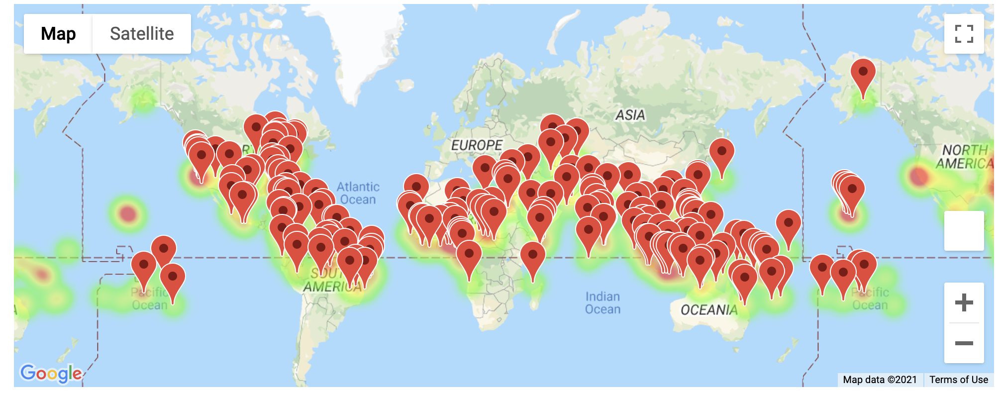
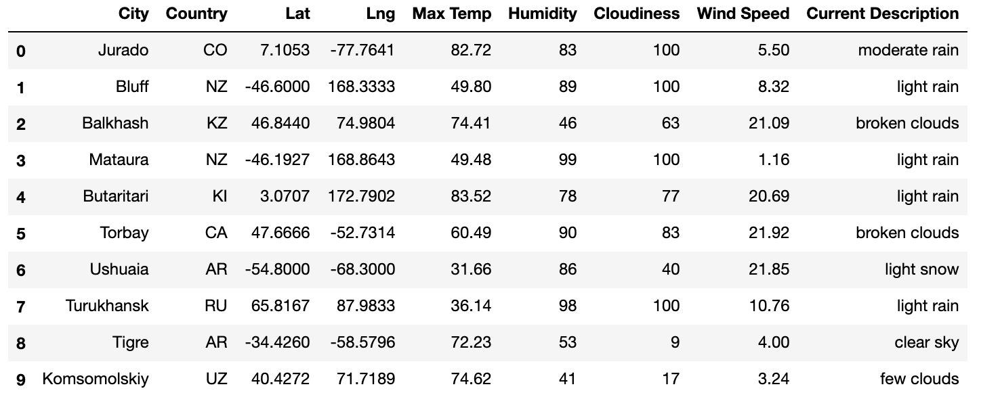
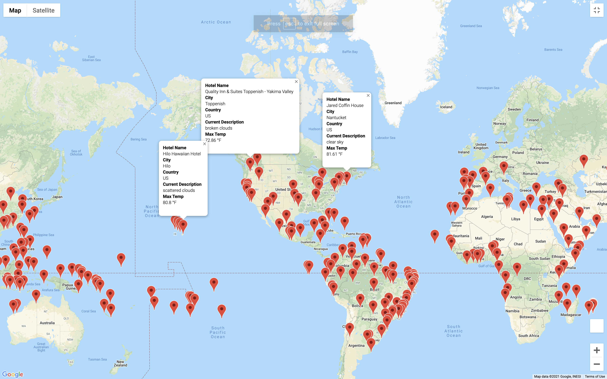
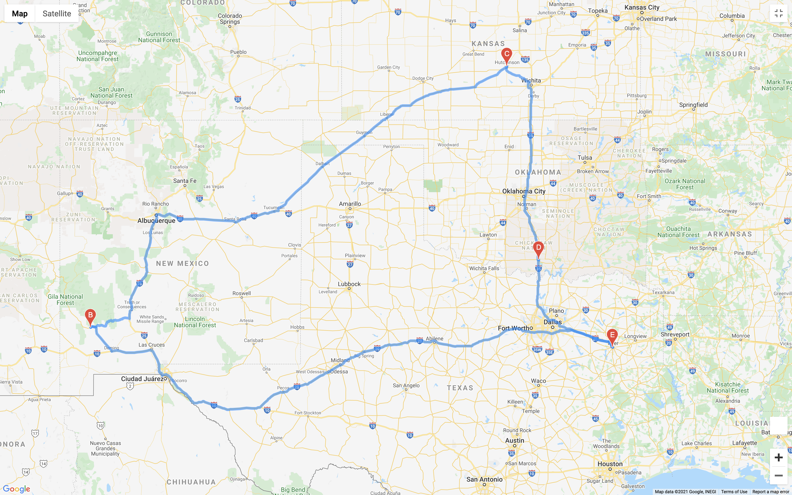
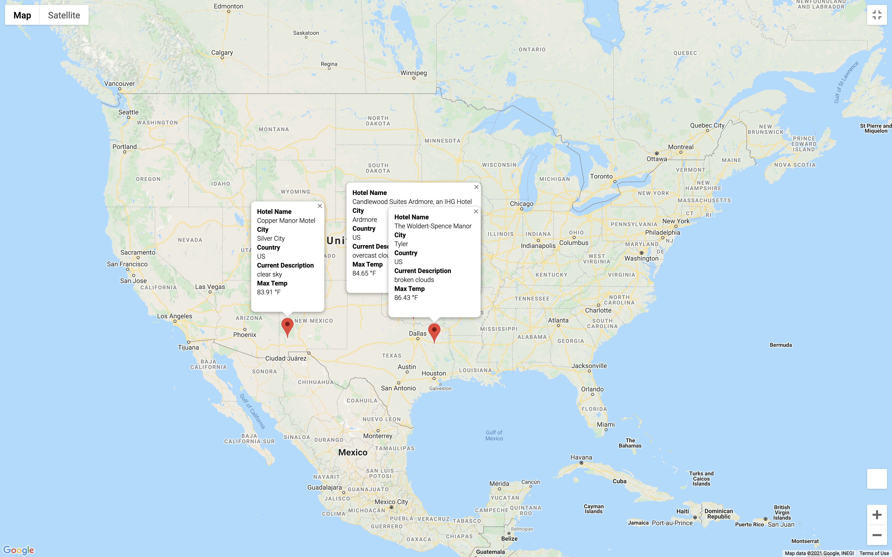

# World_Weather_Analysis

Weather Analysis using API

## Purpose:

**Weather Database**

The main purpose of the Weather Database is to create a weather App and help travelers choose travel locations based on weather conditions and temperature. For this project 2000 random location coordinates (latitude and longitude) were generated. Based on the coordinates generated and using Open weather API key, the City, Country, Max Temp, Current Weather conditions, Humidity, Cloudiness and Wind speed data was obtained and converted into a dataframe.

**Vacation_Search**

The purpose of this project is to create a Customer Travel Destination App, where based on the customer input of desired maximum and minimum temp a list of city names are created. Using the Google Map Platform, searchnearby API, the nearest hotel name is added to the dataframe. The new dataframe now has the City name, Country, Max Temp, current description, coordinates( lat a nd lng) and Hotel name. After creating a clean dataframe with hotel names a google map marker layer is created with locations and hotel info.

**Vacation_Itinerary**

In this project, a four city vacation itinerary is created using Google maps directions API. Followed by the directions map, a marker map is also created using Google map marker, including the Hotel name,City, country, Current description and Max Temp.

